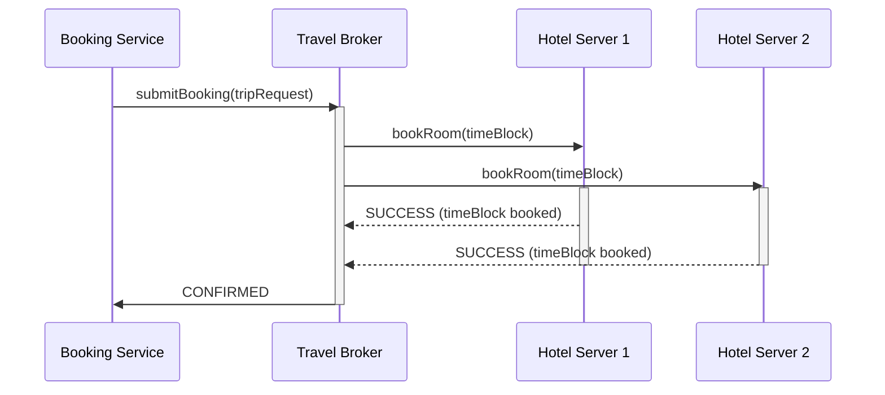
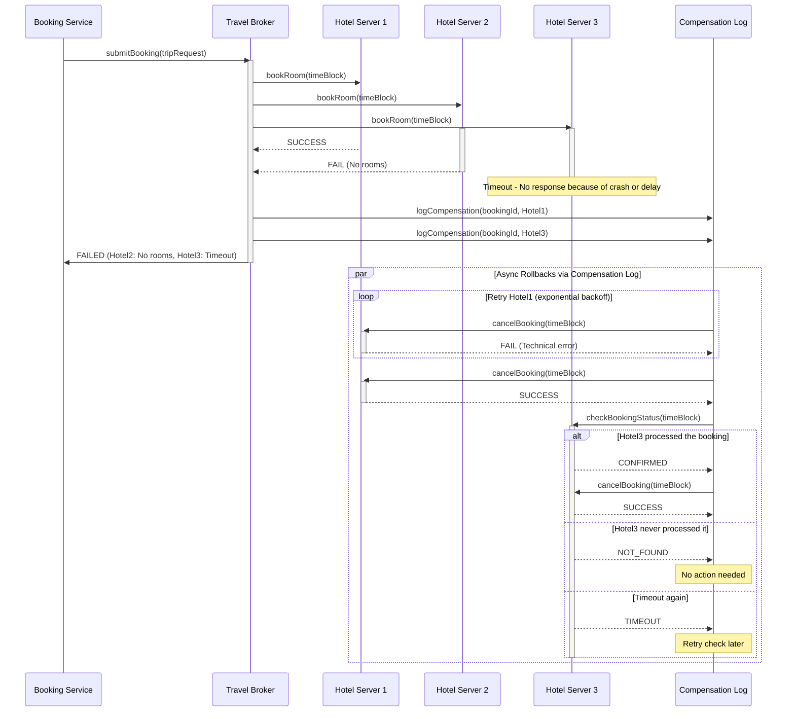

# Error Cases and Handling

### Best Case

### Worst Case

[Exponential Backoff And Jitter | Amazon Web Services](https://aws.amazon.com/blogs/architecture/exponential-backoff-and-jitter/)

When one of the hotels explicitly replies with *FAIL*, the broker stops waiting for the remaining answers, declares the whole trip unsuccessful and writes a compensation entry for every hotel that had already confirmed. Those confirmations are then cancelled asynchronously; the compensation service keeps retrying the `cancelBooking` call with exponential back-off until each hotel acknowledges, so the system always winds up in a clean state.

If a hotel processes the booking but its reply is lost on the way back, the broker sees no answer at all. It treats the situation as “state unknown”, fails the trip and logs a probe task. The compensation service later asks that hotel for the booking’s status: if the room is indeed reserved it is cancelled exactly once, if not, nothing further happens. A plain timeout (where the hotel crashed or was too slow) follows the same path; the only difference is that the probe may have to wait until the server is back online.

Rollback traffic itself can fail, for example because a hotel is momentarily unreachable. In that case the compensation log simply schedules another attempt; retries continue with exponentially increasing intervals until the hotel finally responds or an operator intervenes. Because each cancel operation is idempotent, multiple deliveries are harmless.

Clients may resend the same trip request if their first attempt times-out. The broker recognises repeated `bookingId`s, ignores the duplicate work and returns the already computed outcome. This idempotence rules out double bookings even under flaky client connectivity.

With these mechanisms the platform guarantees eventual consistency: after transient failures or retries the final state will be either “all hotels booked” or “no hotel booked”, never an inconsistent mix.