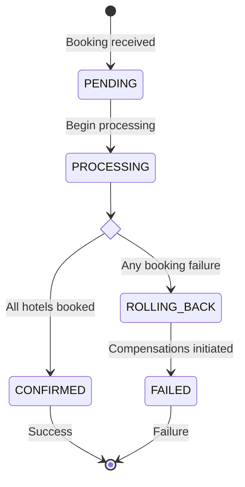
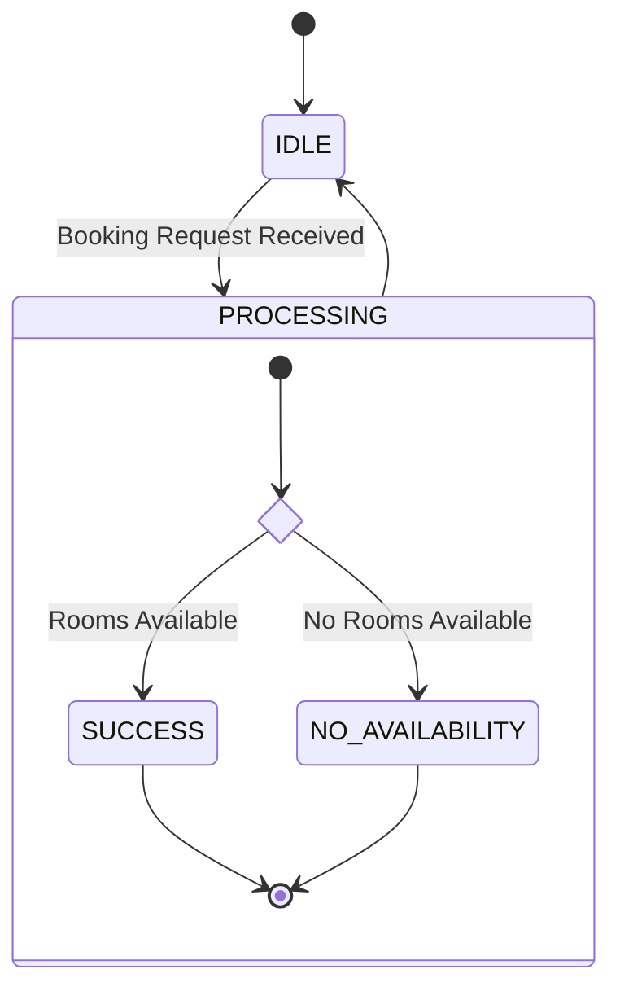
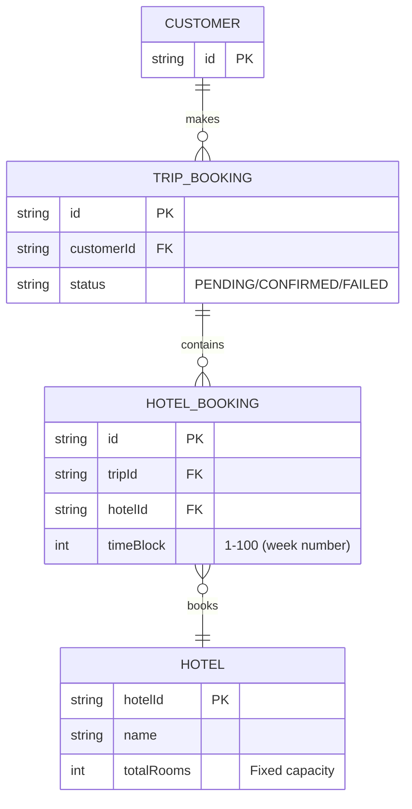
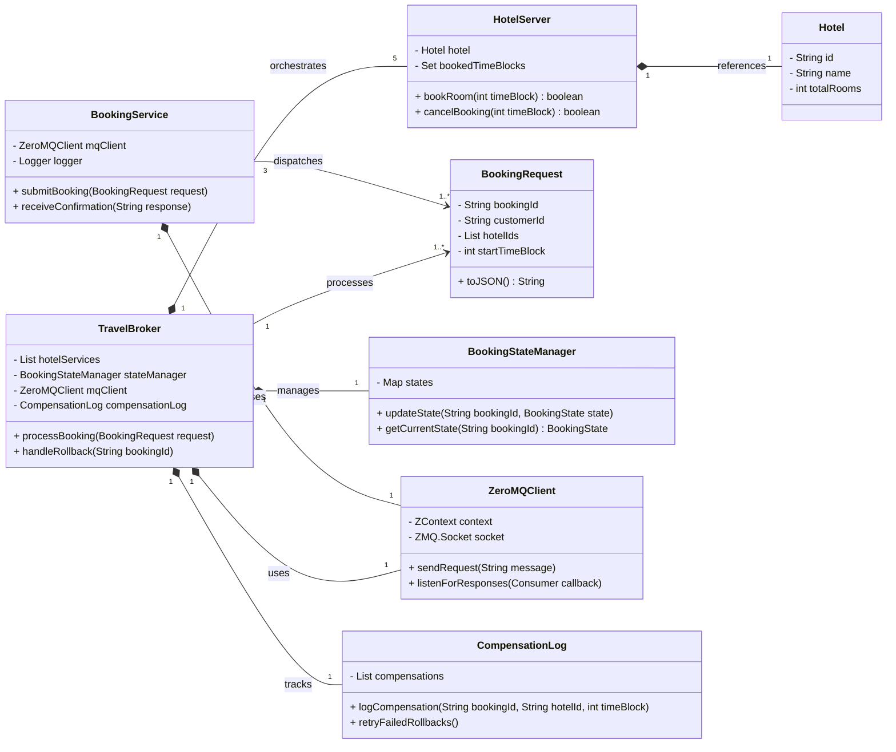
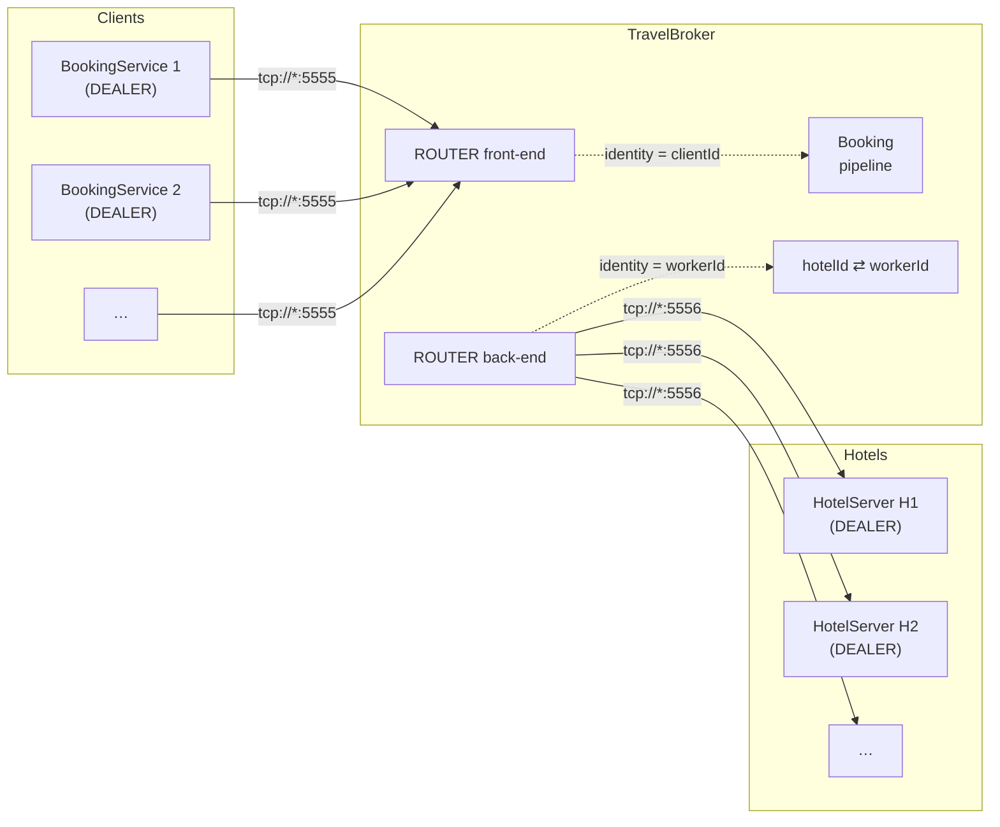

# High-Level Architecture

# Systems

## Booking Service

→ Client system, 3 reliable instances at runtime

- Generates booking requests
    - Configuration: Request dispatch rate
        
        = Travel Broker Request Arrival Rate (delay between travel bookings) * booking service count (3)
        
- Logs results as human-readable messages
    - if failure: display detailed cause and compensation action

## Travel Broker

→ Singleton, reliable central orchestrator

- Receives trip bookings from the booking services
    - no request validation, correct format expected
- Sends booking requests to the hotel servers in parallel
    - all-or-nothing commitment
    - compensation in case of any failure
- Coordinates the [SAGA pattern](https://learn.microsoft.com/en-us/azure/architecture/patterns/saga) for trip bookings
    - Handles compensations (rollbacks) and retries
    - Does only store data during the life cycle of a booking request and compensations
        
        → no persistent storage
        
- Manages booking state transitions
- Responds to booking service with either success or failure + details message

### States

| Status | Meaning |
| --- | --- |
| `PENDING` | Booking request received, awaiting processing (e.g. because of message queuing or concurrency limits). |
| `PROCESSING` | Actively coordinating hotel bookings. |
| `CONFIRMED` | All hotel bookings succeeded. |
| `ROLLING_BACK` | Compensating for failed bookings (rollbacks in progress). |
| `FAILED` | Final failure state, compensations attempted. |



- All failure compensations are tracked internally. Failures are logged but not represented as separate states for simplicity.
- Optimistically transitioning to the failed state directly after initiating the rollbacks avoids complex timeout logic. The travel broker relies on eventual consistency and retries for pending compensations even after sending a failure response.

## Hotel Server

→ 1 unreliable instance per hotel, 5 hotels at runtime

- Receives bookings from travel broker
    - no request validation, correct format expected
- Handles hotel-specific bookings and rollbacks
- Simulates technical/business failures and delays
- Uses thread-safe inventory (e.g. ConcurrentHashMap)



### Simulation Configuration

- Parameters should be variable in program or adjustable via configuration file
    - Average processing time of inquiries
    - Acceptance rate without processing (likelihood of not going from idle to processing)
    - Processing rate without confirmation (likelihood of not sending a response after booking internally)
- Random Numbers are generated based on normal distributions
- The test data should trigger “no availability” business failures at least occasionally

# Technical Implementation

## Data Model



- Assumed simplifications
    - Each customer books a whole room, so no room entity and guest capacity checks are needed.
    - Each hotel booking spans exactly one week, which avoid overlapping availability checks.

## Core Classes



Further classes and functions may be added as needed, because this design just drafts the core functionalities. 

### Design Decisions

1. **TravelBroker**
    
    **→** Orchestrator
    
    - Aggregates multiple hotel servers (one per hotel) to parallelize bookings.
    - **Uses `ZeroMQClient`** as a dedicated class for async messaging, which ensures loose coupling.
    - By relying on a `BookingStateManager`, the state tracking (PENDING, PROCESSING, etc.) is centralized for robustness.
2. **Booking Service**
    
    → Frontend client
    
    - Initiates booking requests and logs results.
3. **HotelServer**
    
    **→** Encapsulates business logic
    
    - References `Hotel` and directly checks availability via `totalRooms` and `bookedTimeBlocks`.
4. **BookingRequest**
    
    **→** Data Transfer Object (DTO
    
    - Serializability to JSON facilitates ZeroMQ messaging.
5. **CompensationLog**
    
    **→** for eventual consistency
    
    - The tracking of failed rollbacks enables retries without blocking the main process.
6. **ZeroMQClient**
    
    **→** for asynchronous communication
    
    - Decouples networking logic to promote scalability and testability.

## ZeroMQ Sequence

### High‑level components

| Layer | Process / Component | Socket type | Role |
| --- | --- | --- | --- |
| **Client tier** | *n* × **BookingService** | `DEALER` → connect | Creates trip‑booking requests and receives booking confirmations |
| **Middle tier** | **TravelBroker** (singleton) | `ROUTER` (front) & `ROUTER` (back) → bind | Orchestrates the booking workflow; routes messages between tiers; enforces SAGA/timeout logic |
| **Worker tier** | *m* × **HotelServer** (1 per hotel) | `DEALER` → connect | Owns the inventory for a single hotel and executes book/cancel commands |

### Non‑blocking message flow using Router-Dealer pattern



- **Solid arrows** = TCP connections (encapsulated by ZeroMQ).
- **Dashed arrows inside Broker** = internal hand‑off between the two ROUTER sockets and the broker’s processing logic.
- Every message carries two ZeroMQ frames:
    1. *Routing identity* (assigned automatically by ROUTER/DEALER) – lets the broker send the reply to the correct peer without knowing its TCP address.
    2. *Payload* (JSON DTO).
    

| Requirement | Solution using Dealer-Router |
| --- | --- |
| **Full duplex, non‑blocking I/O** | A `DEALER` can send **and** receive at any time; a `ROUTER` can service multiple peers concurrently. No thread is ever forced to block on a send/receive turn‑taking like `REQ/REP`. |
| **Scalability** | Adding more BookingServices or HotelServers requires **zero** configuration changes on the broker; they just connect to the existing ports. |
| **Dynamic service discovery** | HotelServers self‑register with the message `"READY:<hotelId>"`. The broker keeps a runtime map `hotelId → workerId` instead of static host:port lists. |
| **Failure isolation** | If a HotelServer crashes the TCP connection drops; the broker can detect the missing identity and mark the hotel as unavailable without affecting other workers. |
- **Two unique TCP ports only** – 5555 for clients, 5556 for hotels. Keeping ports fixed simplifies firewalls and lets NAT‑ed servers dial out without incoming rules.
- **Single TravelBroker instance** – centralises orchestration logic (timeouts, SAGA rollbacks).
- **Registration handshake** – a plain text control frame avoids extra control sockets while giving the broker everything it needs to route.
- **JSON DTOs over ZeroMQ frames** – human‑readable, language‑agnostic, and cheap to serialise with Gson.

### Message Lifecycle

1. **BookingService → Broker**
    
    `DEALER` prepends an empty delimiter → Broker’s front `ROUTER` receives `[clientId][payload]`.
    
2. **Broker dispatch → HotelServer**
    
    Broker looks up the target `hotelId`, finds `workerId`, and sends `[workerId][payload]` on the back‑end socket.
    
3. **HotelServer → Broker (reply)**
    
    After processing, the HotelServer’s `DEALER` sends `[payload]`; ROUTER re‑prepends `workerId` automatically.
    
4. **Broker → BookingService (final reply)**
    
    Broker replaces `workerId` with the original `clientId` and forwards `[clientId][payload]` out the front‑end.
    

## Libraries

- [**JeroMQ**](https://github.com/zeromq/jeromq) for asynchronous network communication between systems
    
    → [ZeroMQ Messaging Patterns](https://zguide.zeromq.org/docs/chapter2/#Messaging-Patterns)
    
- ([OpenTelemetry](https://opentelemetry.io/docs/languages/java/) for tracing)
    - Possible custom implementation
        
        ```java
        public class TraceLogger {
            public static synchronized void log(String bookingId, String component, String event, String status) {
                long timestamp = System.currentTimeMillis();
                System.out.printf("[%d] [%s] [%s] %s - %s%n", 
                                  timestamp, bookingId, component, event, status);
            }
        }
        
        /* Sample output
        [1712758432350] [BK1234] [TravelBroker] Booking started - INIT
        [1712758432392] [BK1234] [HotelServiceA] Request received - PENDING
        [1712758432440] [BK1234] [HotelServiceA] Response sent - SUCCESS
        [1712758432500] [BK1234] [TravelBroker] Booking completed - CONFIRMED
        */
        ```
        
- no other external libraries allowed except for logging and visualization!